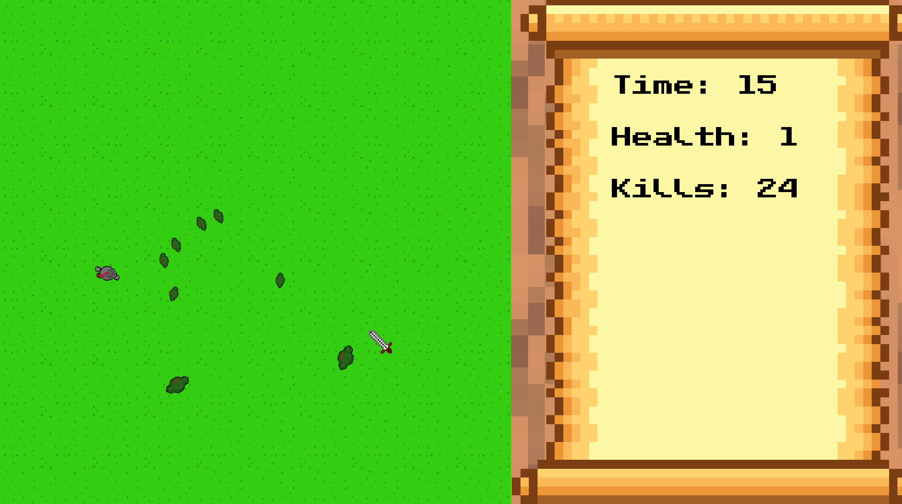

# KNIGHT'S FURY

## by Simon Zwenger and Max Schubert

### Roadmap or Things-To-Do:

- Attack Range (Rec or Circle) DONE
- Highscore List
- Working Options (Sound On Off)
- Set a limit to arrows, that the player can carry and arrow-cooldown DONE
- New Textures for Orc, Ogre - DONE
- More Info on SideMenu (Wave Number, current score, Lives (with graphicx)) ~ DONE 
- Build Welcome Screen (with nice grafix) DONE
- Archer Enemy (fix arrows) - DONE
- balance enemies - DONE

- Optional Features:
    - Player Classes
    - Pet Wolf (simple AI, attack´s in intervalls, the rest of the time roams around player)
    - Loading Bar for current wave (showing killing progress)
    - destroy arrows when hit with sword
    - difficulty slider (player can´t move when hitting)
    - death animations
