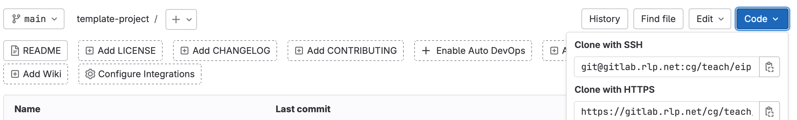

# template-project

## git Installation

### Windows

Installieren Sie `git` von [https://git-scm.com/download/win](https://git-scm.com/download/win) für ihre Prozessorarchitektur (Standalone Installer).

Achten Sie bei der Installation auf folgende Punkte: 
- Setzen Sie den default branch name auf `main`
- `git from the command line and also from 3rd-party software` auswählen
- `Use bundeled OpenSSH` auswählen
- `Use the OpenSSL library` auswählen
- `Checkout as-is, commit as-is` auswählen
- `Use Windows' default console window` auswählen
- `Fast-forward or merge` auswählen
- `Git Credential Manager` auswählen

### Linux
Installieren Sie git mit dem Paketmanager ihrer Distribution. 
#### Debian/Ubuntu
```bash
sudo apt update && sudo apt install git git-gui gitk -y
```
#### Fedora
```bash
sudo dnf install git git-gui gitk -y
```

### macOS

Führen Sie die folgenden Schritte aus, um `git` zu installieren. Wir werden den Paketmanager `Homebrew` verwenden, um `git` zu installieren. Sollten Sie `Homebrew` noch nicht installiert haben, führen Sie die folgenden Schritte aus, um `Homebrew` zu installieren. Homebrew ist ein offener Paketmanager für macOS und erleichtert die Installation von Software und Tools insbesondere für Entwickler.

#### Installation von Xcode Command Line Tools
```bash
xcode-select --install
```

#### Installation von Homebrew
```bash
/bin/bash -c "$(curl -fsSL https://raw.githubusercontent.com/Homebrew/install/HEAD/install.sh)"
```

Während der Installation von Homebrew werden Sie aufgefordert, die Installation zu bestätigen. Drücken Sie die `Return`-Taste, um die Installation zu bestätigen.
Um homebrew ihrem PATH hinzuzufügen, führen Sie den folgenden Befehl aus:
```bash
echo 'eval "$(/opt/homebrew/bin/brew shellenv)"' >> /Users/$(whoami)/.zprofile
eval "$(/opt/homebrew/bin/brew shellenv)"
```

Anschließend sollten sie in einer neuen Terminal-Session `brew` verwenden können.
```bash
brew --version
```

#### Installation von git mit Homebrew
```bash
brew install git
```

## git Einrichtung

Unter Windows führen Sie die folgenden Befehle in einer PowerShell Instanz aus. Unter Linux und macOS können Sie die Befehle in einer Terminal-Instanz (bash,zsh) ausführen.

### Konfiguration
```bash
git config --global user.name "Ihr Name"
git config --global user.email "Ihre E-Mail-Adresse" 

git config --global core.editor "code --wait" # Visual Studio Code als Standard-Editor für Commit Nachrichten
```
### SSH Schlüssel

SSH ist ein Protokoll, das für die sichere Verbindung zu einem entfernten Server verwendet wird. Um SSH zu verwenden, müssen Sie einen SSH-Schlüssel erstellen und diesen auf dem Server hinterlegen. git verwendet SSH, um sich mit einem entfernten Repository zu verbinden.

#### Erstellen eines SSH-Schlüssels
```bash
ssh-keygen -t rsa -b 4096
```
Bestätigen Sie die folgenden Fragen mit der `Enter`-Taste.

> **Wichtig** Geben Sie keine Passphrase ein.

#### Upload des SSH Schlüssels auf Gitlab
```bash
cat ~/.ssh/id_rsa.pub | clip # Kopiert den SSH Schlüssel in die Zwischenablage
```
Navigieren Sie auf der gitlab Webseite zu "Settings" -> "SSH Keys" -> "Add new Key" und fügen Sie den SSH Schlüssel ein.

#### Klonen des Repositories
Klonen Sie das Repository mit dem SSH Link.

Diesen finden Sie unter "Clone with SSH" (siehe Bild).
```bash
git clone <URL>
```

Anschließend können Sie den Ordner in Visual Studio Code öffnen und mit der Arbeit beginnen.

## git Cheat Sheet

### Grundlegende Befehle
| Befehl | Beschreibung |
| --- | --- |
| `git init` | Initialisiert ein neues git Repository |
| `git clone <URL>` | Klonen eines bestehenden Repositories |
| `git status` | Zeigt den Status des Arbeitsverzeichnisses |
| `git add <file>` | Fügt eine Datei zum Staging-Bereich hinzu |
| `git commit -m "Nachricht"` | Commited die Änderungen im Staging-Bereich |
| `git push` | Pushed die Commits zum entfernten Repository (Server) |
| `git pull` | Lädt die Änderungen aus dem entfernten Repository (Server) |
| `git stash` | Versteckt die Änderungen im Arbeitsverzeichnis (setzt diese zurück) |

### Branches

Branches sind eine Möglichkeit, um an verschiedenen Features oder Bugfixes zu arbeiten, ohne die Hauptentwicklung zu beeinflussen.

Vorstellen können Sie sich dies wie ein Baum, der sich in verschiedene Äste aufteilt mit Pfeilen, welche auf einzelne Punkte im Baum zeigen. Ein solcher Punkt ist ein Commit, während ein Pfeil einen Branch repräsentiert (siehe Bild).


Auf diesen branches können unabhängig voneinander Änderungen vorgenommen werden. Anschließend können die Änderungen in den Hauptbranch gemerged werden. Merge ist ein Prozess bei dem die Änderungen eines Branches in einen anderen Branch übernommen werden. Dabei wird der Verlauf des Branches beibehalten. und die Änderungen des Branches werden in den aktuellen Branch übernommen (siehe Bild).


Alternativ kann auch ein Rebase durchgeführt werden. Beim Rebase werden die Änderungen des aktuellen Branches auf den angegebenen Branch angewendet. Dabei wird der Verlauf des aktuellen Branches beibehalten und die Änderungen des aktuellen Branches werden auf den angegebenen Branch angewendet (siehe Bild).


In beiden Fällen kann es auch zu Konflikten kommen, die manuell gelöst werden müssen. Dies nennt man einen Merge-Konflikt.
In dem Fall markiert git in der Ausgabe die Dateien, die Konflikte enthalten. Wenn Sie eine solche Datei öffnen werden Sie sehen, dass git die Konflikte markiert hat. Diese werden in der Form `<<<<<<<`, `=======` und `>>>>>>>` dargestellt. Sie müssen die Konflikte manuell auflösen.
Haben Sie die Konflikte aufgelöst, müssen Sie die Dateien erneut mit `git add` hinzufügen und anschließend den Commit durchführen.

| Befehl | Beschreibung |
| --- | --- |
| `git branch` | Zeigt die Branches |
| `git checkout <branch>` | Wechselt zu einem anderen Branch |
| `git checkout -b <branch>` | Erstellt einen neuen Branch basierend  |
| `git merge <branch>` | Merged den angegebenen Branch in den aktuellen Branch |
| `git rebase <branch>` | Rebasen des aktuellen Branches auf den angegebenen Branch |


### Remote
| Befehl | Beschreibung |
| --- | --- |
| `git remote -v` | Zeigt die entfernten Repositories |
| `git remote add <name> <URL>` | Fügt ein neues entferntes Repository hinzu |
| `git remote remove <name>` | Entfernt ein entferntes Repository |
| `git remote set-url <name> <URL>` | Ändert die URL des entfernten Repositories |

Wenn ein branch neu erstellt wurde oder eine neues remote hinzugefügt wurde, kann es sein, dass der branch nicht getrackt wird. In diesem Fall kann der branch mit dem folgenden Befehl getrackt werden.
```bash
git branch -u origin/<branch>
```
Dies sorgt dafür, dass der branch bei einem `git pull` oder `git push` automatisch mit dem entfernten Repository synchronisiert wird.